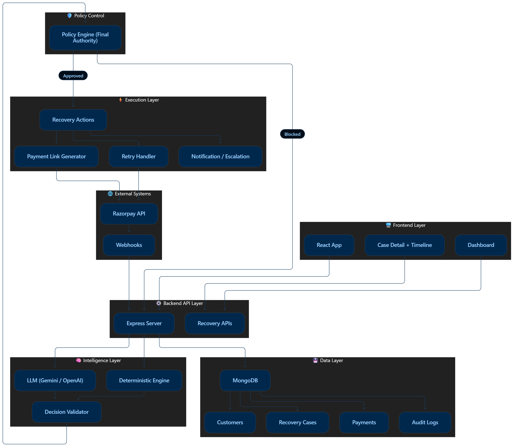
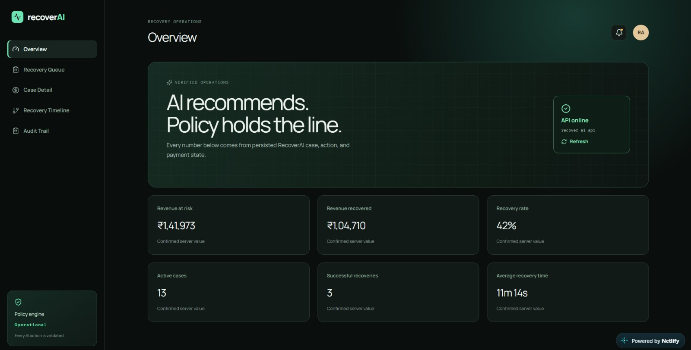
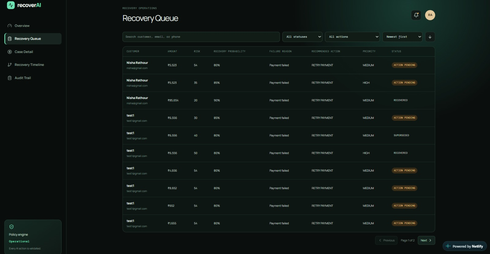
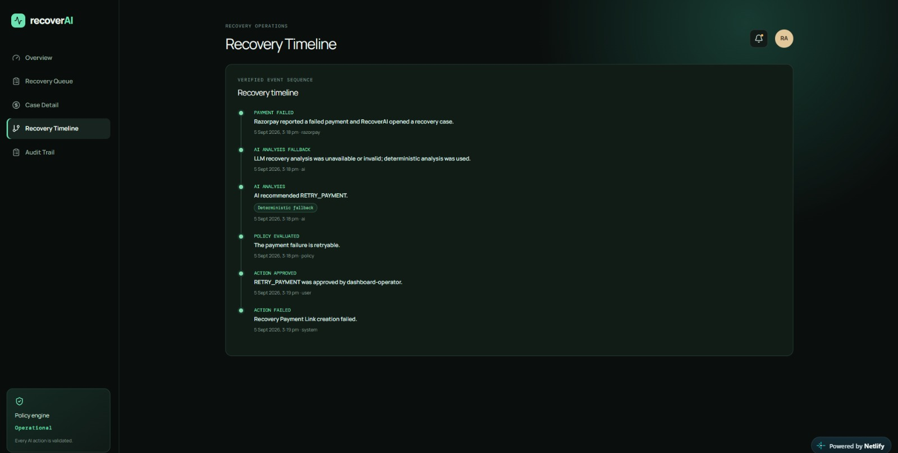

<div align="center">


# 🚀 RecoverAI — Intelligent Revenue Recovery System

> **AI-powered system to recover failed payments using smart retries, payment links, and escalation — safely, transparently, and at scale.**

[](https://willowy-lollipop-3d56dd.netlify.app)

---

<p align="center">
  
  
  
  
  
  
  
</p>


</div>

---
---


---

## 📚 Table of Content

- [⚡ What is RecoverAI?](#-what-is-recoverai)
- [🚨 Problem Statement](#-problem-statement)
- [💡 Solution](#-solution)
- [✨ What Makes It Different](#-what-makes-it-different)
- [🏗️ Architecture](#️-architecture)
- [🔁 End-to-End Flow](#-end-to-end-flow)
- [🔄 Data Flow](#-data-flow--step-by-step)
- [🔬 Core Features in Detail](#-core-features-in-detail)
- [📦 Output Schema](#-output-schema)
- [🚀 Product Walkthrough](#-product-walkthrough)  ✅ ADD THIS
- [🔗 Recovery Journey](#-recovery-journey)
- [🧠 AI Decision Strategy](#-ai-decision-strategy)
- [🔐 Safety & Reliability](#-safety--reliability)
- [⚡ Key Features](#-key-features)
- [🛠️ Technology Stack](#️-technology-stack)  ✅ ADD THIS (missing earlier)
- [📁 Project Structure](#-project-structure)
- [🔑 Environment Variables](#-environment-variables)
- [⚡ Getting Started](#-getting-started)
- [🧪 Testing & Verification](#-testing--verification)

---

## ⚡ What is RecoverAI?

RecoverAI is a **decision-driven AI system** that detects failed payments and intelligently decides:

- Should we retry the payment?
- Should we send a reminder?
- Should we escalate to a human?

It then executes the decision **securely using Razorpay APIs**.

---

## 🚨 Problem Statement

Failed payments silently kill revenue.

Most systems:
- ❌ Treat failures as final  
- ❌ No intelligent retry strategy  
- ❌ Ignore customer and failure context  
- ❌ No visibility into recovery attempts  

👉 Result: **Revenue loss with no recovery strategy**

---

## 💡 Solution

RecoverAI introduces a **smart recovery engine**:

- 🤖 AI recommends the best recovery action  
- 🧠 Deterministic engine ensures fallback reliability  
- 🛡️ Policy engine controls execution (final authority)  
- 💳 Razorpay powers real payment recovery  
- 🔗 Recovery Journey tracks full lifecycle  

---
## 🚀 Live Demo

https://willowy-lollipop-3d56dd.netlify.app" 
 


## ✨ What Makes It Different

1. **Bounded AI, not blind automation** — AI recommends one structured action; policy remains the final authority.
2. **Verified money recovery** — a case is marked recovered only after a signed Razorpay webhook confirms payment success.
3. **Human-in-the-loop execution** — recovery actions move from recommendation to approval to execution.
4. **Safe retries** — each recovery attempt is idempotent, linked to its journey, and never reuses a failed payment ID.
5. **Operational visibility** — the dashboard shows revenue at risk, revenue recovered, recovery rate, cases, and audit events.

---

## 🏗️ Architecture

>

<p align="center">
  
</p>

---

## 🔁 End-to-End Flow

### 1️⃣ Failure Detection
- Razorpay webhook detects failed payment  
- Payment + customer stored  
- `RecoveryCase` created  

---

### 2️⃣ AI Analysis (`POST /api/recovery/:recoveryCaseId/analyze`)


LLM (Gemini/OpenAI)
↓
Structured Decision
↓ (fallback)
Deterministic Engine


Output includes:
- riskScore  
- recoveryProbability  
- priority  
- recommendedAction  
- diagnosis  
- reason  

---

### 3️⃣ Validation + Policy


AI suggests → Policy decides


Checks:
- retry limits  
- case status  
- failure reason  
- business rules  

---

### 4️⃣ Human Approval


pending → approved →execute


---

### 5️⃣ Execution (`POST /api/recovery/actions/:actionId/execute`)

| Action | Behavior |
|------|---------|
| 💳 CREATE_PAYMENT_LINK | New Razorpay payment link |
| 🔁 RETRY_PAYMENT | New retry link (never reuse failed payment) |
| 📩 SEND_REMINDER | Notification stored |
| 💳 OFFER_ALTERNATIVE_PAYMENT | Options saved |
| 🧑‍💼 ESCALATE_TO_HUMAN | Escalation record |
| 🚫 DO_NOTHING | Case closed |

---

### 6️⃣ Payment Success

- Razorpay webhook triggers  
- `reference_id → recovery_case` mapped  
- Case marked as recovered  

---

## 🔄 Data Flow — Step by Step

```text
1. Razorpay sends a signed payment.failed webhook
2. RecoverAI validates the signature and stores customer + payment context
3. A RecoveryCase is created and analyzed by AI or deterministic fallback
4. Policy evaluates the recommendation and creates a recovery action
5. An operator approves the action
6. RecoverAI creates a Razorpay Payment Link or executes the approved workflow
7. Razorpay sends payment_link.paid or payment.captured
8. RecoverAI records recovered revenue, closes the journey, and writes the audit trail
```

---

## 🔬 Core Features in Detail

### 🤖 AI Recovery Decision Engine

- Uses customer history, payment amount, payment method, failure reason, and previous attempts.
- Supports OpenAI and Gemini structured recommendations.
- Falls back to deterministic logic if an AI provider is unavailable or returns invalid output.

### 🛡️ Policy and Approval Controls

- Validates permitted actions, retryability, retry limits, case state, amount, and customer contact availability.
- Requires the workflow `pending → approved → executed`.
- Blocks unsafe or duplicate recovery execution.

### 💳 Razorpay Recovery Integration

- Verifies Razorpay webhook signatures with HMAC.
- Creates deterministic Payment Link references for recovery and retry actions.
- Uses Razorpay events, not UI claims, as the source of truth for recovered revenue.

### 📊 Recovery Operations Dashboard

- Shows live revenue-at-risk and recovered-revenue metrics.
- Provides a searchable recovery queue, case details, journey timeline, and audit trail.
- Tracks escalation, reminder preparation, alternative-payment options, and Payment Link execution.

---

## 📦 Output Schema

Every recommendation is validated before it can become a recovery action:

```json
{
  "riskScore": 62,
  "recoveryProbability": 0.72,
  "priority": "HIGH",
  "recommendedAction": "CREATE_PAYMENT_LINK",
  "diagnosis": "The payment failed after an initial authorization attempt.",
  "reason": "A secure Payment Link offers the customer a low-friction recovery path.",
  "confidence": 0.72,
  "rationale": "The customer has recoverable payment history and valid contact details."
}
```

Allowed actions: `RETRY_PAYMENT`, `CREATE_PAYMENT_LINK`, `SEND_REMINDER`, `OFFER_ALTERNATIVE_PAYMENT`, `ESCALATE_TO_HUMAN`, and `DO_NOTHING`.

---
## 🚀 Product Walkthrough

<p align="center">

<h3>🏠 Home Page</h3>


<br/>

<h3>📊 Recovery Queue</h3>


<br/>

<h3>⏱️ Recovery Timeline</h3>


<br/>

<h3>🔍 Audit Trail</h3>


</p>

---

## 🔗 Recovery Journey

Instead of isolated retries:


Case A ❌ → Case B ❌ → Case C ✅


Tracked using:
- parentRecoveryCase  
- rootRecoveryCase  
- attemptNumber  
- supersededBy  
- journeyStatus  

✔ Full chain tracked  
✔ Final success = entire journey recovered  

---

## 🧠 AI Decision Strategy

| Risk | Mitigation |
|------|-----------|
| AI failure | Deterministic fallback |
| Hallucination | Schema validation |
| Unsafe actions | Policy engine |
| API downtime | Graceful fallback |

---

## 🔐 Safety & Reliability

- ✅ Human approval required  
- ✅ Idempotent execution (no duplicates)  
- ✅ No fake recovery without webhook  
- ✅ Never reuse failed payment IDs  
- ✅ Full audit trail  
- ✅ Strict error handling  

---

## ⚡ Key Features

- 🚀 AI-powered recovery decisions  
- 🔁 Smart retry mechanism  
- 🛡️ Policy-controlled execution  
- 💳 Real Razorpay integration  
- 🔗 Recovery journey tracking  
- 📊 Audit logs  
- ⚙️ Deterministic fallback  
- 📱 Responsive dashboard  

---

## 🛠️ Technology Stack

### Backend

| Technology | Purpose |
|---|---|
| Node.js + Express | API and webhook receiver |
| MongoDB + Mongoose | Recovery cases, payments, actions, and audit data |
| Razorpay SDK | Payment Link creation and payment recovery workflows |
| CORS + security middleware | Browser access control and safer HTTP responses |

### Frontend

| Technology | Purpose |
|---|---|
| React 19 | Recovery operations dashboard |
| Vite | Development server and production build |
| Tailwind CSS | UI styling pipeline |
| Lucide React | Interface icons |

### AI & External Services

| Service | Usage |
|---|---|
| OpenAI | Structured recovery recommendations (optional) |
| Google Gemini | Structured recovery recommendations (optional) |
| Deterministic engine | Reliable fallback when no AI provider is available |
| Razorpay | Payment events, Payment Links, and signed webhooks |
| Render + Netlify | API and dashboard deployment |

---

## 📁 Project Structure

```text
Razorpay-AI-revenue-recovery/
│
├── client/ # React + Vite frontend (Dashboard UI)
│ ├── dist/ # Production build output
│ │ ├── assets/
│ │ └── index.html
│ ├── src/
│ │ ├── components/ # Reusable UI components
│ │ ├── services/
│ │ │ └── api.js # API integration layer
│ │ └── App.jsx # Main dashboard + workflow UI
│ ├── index.html
│ ├── package.json
│ └── vite.config.js
│
├── server/ # Node.js + Express backend
│ ├── src/
│ │ ├── agent/ # AI prompts & decision logic
│ │ ├── models/ # MongoDB schemas
│ │ ├── routes/ # API & webhook routes
│ │ ├── services/ # Business logic (recovery, Razorpay, AI)
│ │ └── seed/ # Seed scripts for demo/testing
│ ├── test/ # Backend tests
│ ├── .env # Server environment variables
│ └── package.json
│
├── assets/
│ └── architecture.png # System architecture diagram
│
├── .env.example # Sample environment variables
├── .gitignore
├── package.json # Root config (if any)
├── render.yaml # Render backend deployment config
└── netlify.toml # Netlify frontend deployment config
```

---

## 🔑 Environment Variables

```bash
# AI Provider
RECOVERY_AI_PROVIDER=gemini
GEMINI_API_KEY=your_key
GEMINI_MODEL=gemini-2.5-flash

# OR
RECOVERY_AI_PROVIDER=openai
OPENAI_API_KEY=your_key
OPENAI_MODEL=gpt-4.1-mini

# Razorpay
RAZORPAY_KEY_ID=your_key
RAZORPAY_KEY_SECRET=your_secret
RAZORPAY_WEBHOOK_SECRET=your_secret
```

⚠️ Never commit .env
✔ Use .env.example

---

## ⚡ Getting Started

```bash
# Clone repository
git clone https://github.com/your-username/recoverai.git

# Install backend
cd server
npm install

# Install frontend
cd ../client
npm install

# Run backend
cd ../server
npm run dev

# Run frontend
cd ../client
npm run dev
```

---

## 🧪 Testing & Verification
Covers:

- AI decisions
- Fallback logic
- Policy enforcement
- Execution lifecycle
- Webhook handling
- Duplicate protection

---

## 🚀 Future Enhancements

- ⏱️ Smart retry scheduling
- 📊 Analytics dashboard
- 📩 Email / SMS notifications
- 🧠 ML-based learning
- 🎯 Customer segmentation

---

## 🏁 Final Note

RecoverAI is not just retry logic.

It is a decision engine that combines:

- 🧠 AI intelligence
- ⚙️ Deterministic reliability
- 🛡️ Policy control

to recover lost revenue safely and intelligently.

<p align="center">🔥 Built for real-world payment recovery. Ready to scale.</p>

---

<div align="center">

### Developed by Nisha Rathour

**ABES Engineering College, Ghaziabad**

[](https://willowy-lollipop-3d56dd.netlify.app)

</div>
